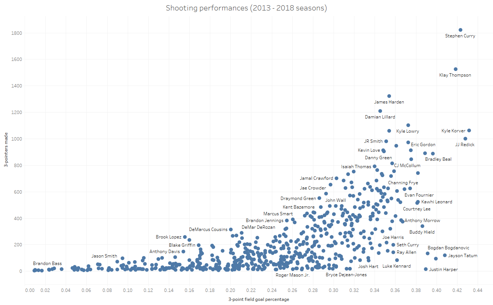
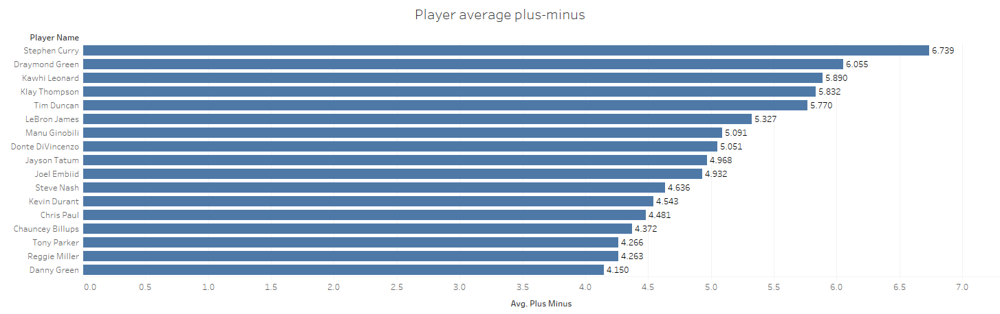

If you follow NBA basketball at all, you'll know how Steph Curry has revolutionised the game with his out-of-this-world shooting, and all-around skill. 

If you don't, here are a two simple charts showing his greatness. For a better demonstration of how electrifying he is as a player, watch his highlights on youtube (data can't show you everything you know!).

Here's the [data set](https://www.kaggle.com/nathanlauga/nba-games).

This scatter plot is a visualisation of his shooting poweress. Full disclosure, I cherry-picked a time frame where Curry was at his hottest. 

Not only is he far ahead of all players in 3-pointers made at 1,821 buckets (at the top-most point on the vertical axis) in this time frame, he's also achieved this on great efficiency, making about 42.3% of his 3-point attempts. This is the best of any player who has made more than 1200 3-pointers (oh wait, there's only 4 of them). This 42.3% 3-point shooting percentage is also ranked 3rd regardless of shooting volume. 

We would be remissed if he did not look at his overall impact on the court. The eye test show us how he is able to impact the game both on and off the ball, a skill that is rare even in the world's most competitive league. When he has the ball, he's a threat to score from anywhere on the court. When he's not holding the ball, the entire opposition defense is looking for him, lest chaos ensures once he comes off a screen.

The data confirms his overall impact, with Steph owning the highest plus-minus average of all players between 2003 to 2020. (Plus−minus is a sports statistic used to measure a player's impact on the game, represented by the difference between their team's total scoring versus their opponent's when the player is in the game.)

To wrap this short one up, I guess you could argue that his defense is a tad lacking. A little digging into the data shows me otherwise, but that's something for another time!

